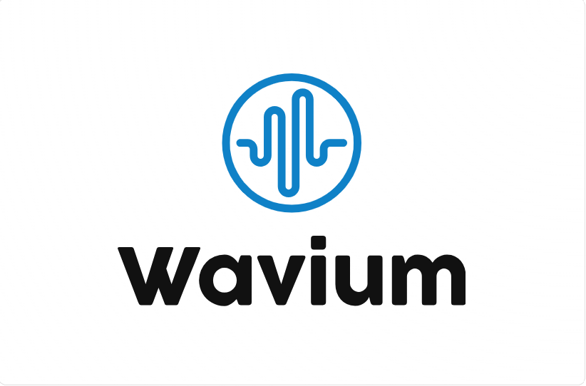
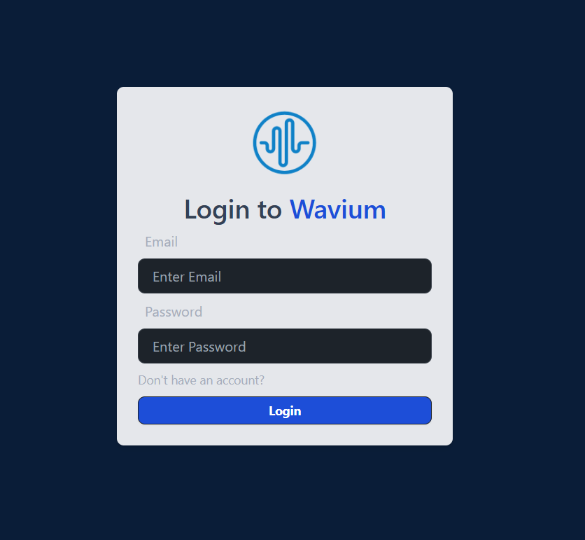
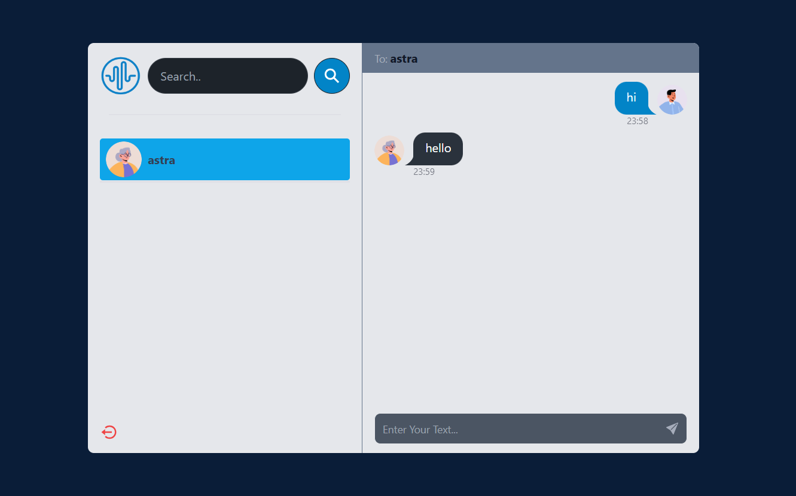

# Wavium



Wavium is a web-based chat application that facilitates end-to-end messaging between users. Built with React, Wavium provides a seamless and interactive chat experience using real-time updates powered by Socket.io and JWT for secure client-server connections. The frontend is styled with Tailwind CSS, and the application uses MongoDB for database management and Express.js for server-side logic.

## Features

- **Real-Time Messaging**: Instant communication between users using Socket.io.
- **End-to-End Encryption**: Secure message transmission with JWT.
- **Responsive Design**: Modern and responsive UI with Tailwind CSS.
- **Database Integration**: MongoDB for managing user data and chat history.
- **Backend Framework**: Express.js for handling server-side operations.
## Technologies Used:
- **Backend**: MongoDB, NodeJs, Socket.io, JWT, ExpressJS.
- **Frontend**: ReactJS, Tailwind CSS

## Getting Started

To get a local copy up and running follow these simple steps.

### Prerequisites

Make sure you have the following installed:

- [Node.js](https://nodejs.org/) (includes npm)
- [MongoDB](https://www.mongodb.com/try/download/community) (for local development)

## Installation

1. **Clone the repository:**

   ```bash
   git clone https://github.com/Souptim/wavium.git
   cd wavium
2. **Install Node packages:**
  - Installing frontend:
    ```bash
    cd frontend
    npm install
  - Installing backend:
     ```bash
     cd ../backend
     npm install
3. **Configure Environment Variables:**
- Create a .env file in the backend directory and add the following variables:
     ```env
     MONGO_URL=your_mongodb_connection_string
     JWT_SECRET=your_jwt_secret
4. **Start the application:**
- Start the backend server:
     ```bash
     cd backend
     npm run dev
- Start the frontend development server:
     ```bash
     cd ../frontend
     npm run dev
The application will be available at `http://localhost:3000` for the backend
  and `http://localhost:5173` for frontend.
## Usage
- Register a new user or log in with existing credentials.
- Start chatting with other users in reeal-time.
- Enjoy a responsive and secure messaging experience.
## Screenshots
- Login Page:

- Application UI:



